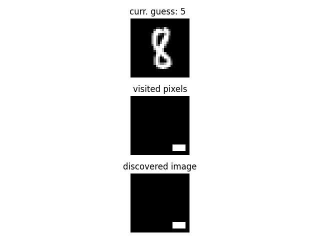
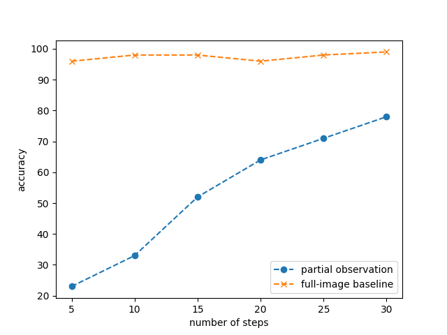

# Intelligent Scan Agent (RL Active Perception)

This project implements a reinforcement learning agent that scans a partially observed MNIST digit and learns an exploration policy to classify the digit using as few steps as possible.

The agent moves over a masked image, reveals local pixels, and uses a lightweight classifier (perceptron) to maintain digit probabilities during exploration. Optionally, the agent can take a "guess" action to terminate the episode early.



## Results

Accuracy improves as the agent is allowed to scan more steps, approaching the full-image baseline.

Example results (replace with your run output):
5 | 23% | 96%
10 | 33% | 98%
15 | 52% | 98%
20 | 64% | 96%
25 | 71% | 98%
30 | 78% | 99%



Note: Trained agent net and perceptron are saved in data and will be reoaded in next run of the program. 

## What this demonstrates

- A custom RL environment with a scan budget constraint (information gathering vs decision making)
- A DQN-based policy that learns where to scan next (active perception)
- Evaluation across scan budgets, producing an accuracy vs steps curve

## Method (high level)

### State
The environment state includes:
- agent position (x, y)
- perceptron probabilities for each digit (10-class)
- local pixel neighborhood within a configurable discovery radius (rng / rng_discover)

### Actions
- up, down, left, right
- optional: guess (terminate episode and output predicted digit)

### Rewards (configurable)
- step cost (encourages efficient scanning)
- penalties for invalid moves / bouncing
- reward for correct guess and penalty for incorrect guess
- optional reward shaping for discovering informative pixels

### Parameters
- nsteps: maximum number of steps per episode (scan budget)
- rng: size/radius of the local image patch included in the state
- rng_discover: radius around the agent position revealed at each step (0 - single pixel discovered)
- gamma: discount factor
- tau: target network soft update rate
- lr: learning rate

## Training stages

1) Perceptron training  
   A simple perceptron is trained to estimate digit probabilities. These probabilities are used as part of the RL state.

2) Navigation training (no guess action)  
   The agent learns an efficient scanning policy using movement actions only.

3) Decision making (guess enabled)  
   A fifth action is enabled (guess) and the agent learns when to stop scanning and commit to a prediction.

## Quickstart

1) Install dependencies:
```bash
pip install -r requirements.txt
python agent.py

Notes and improvement ideas
-Performance can be improved by training longer and tuning lr, tau, and gamma. It works better if trained for lowering lr + rewards changed to drive agent towards more greedy policies and induce faster guessing. 
-In guessing mode, the random action is intentionally biased toward the guess action to encourage exploration of the additional decision action.
-The perceptron can be retrained on partially observed images to better match the agent’s observation distribution.
-The script periodically saves the best model (every 100 training episodes) based on evaluation success rate.
-The code structure is intended to be adaptable to other scanning tasks beyond MNIST.
-Optional: add CUDA support for faster training and a CLI interface for reproducible runs.
 